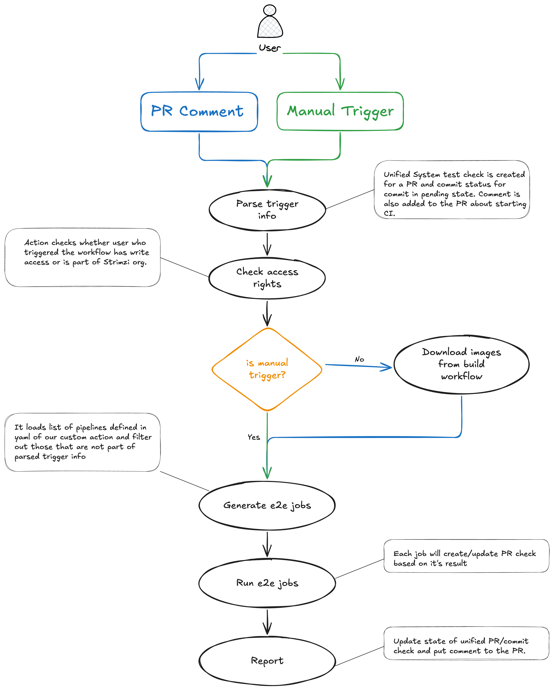

# Build & Test Strimzi in GitHub Actions
The following lines put together basic information how is Strimzi built and tested via GitHub Actions.
All the steps mentioned bellow re-use scripts from our [azure](../../.azure) directory and thus all the steps are more or less the same on both systems.

## Build jar artifacts
Building Strimzi is exactly the same as we have in Azure pipelines.
Only difference is in used runners for each step.
Strimzi jars are built on `oracle-2cpu-8gb-arm64` runner as part of [build-strimzi-binaries](../actions/build/build-strimzi-binaries) action.
This runner is basically a Kubernetes pod that runs all the commands defined in the action.

Action output is tar-ball with Strimzi jars that can be used by other actions and workflows.

Usage example can be like this:

```yaml
  build-artifacts:
    name: build-artifacts
    runs-on: oracle-2cpu-8gb-arm64
    steps:
      - uses: actions/checkout@v5
      - uses: ./.github/actions/build/build-strimzi-binaries
        with:
          mvnArgs: "-B -DskipTests -Dmaven.javadoc.skip=true"
```

## Build images
In the same manner as on Azure we build multi-arch images as part of our workflows.
To build the images we use [containers-build](../actions/build/containers-build) action that produce container images for each specific architecture.
This actions has to be called separately for each architecture with matrix strategy you can see bellow:

```yaml
  build-images:
    name: build-images
    strategy:
      matrix:
        architecture: [amd64, arm64]
    runs-on: oracle-vm-2cpu-8gb-arm64
    steps:
      - uses: actions/checkout@v5
      - uses: ./.github/actions/build/containers-build
        with:
          architecture: ${{ matrix.architecture }}
```

As a runner we use `oracle-vm-2cpu-8gb-arm64` which is basically a small arm-based VM.
This runner allows us to build multi-arch images without any tweaks in our build mechanism (container runners from oracle cloud doesn't allow it).

## Supporting actions
In [actions](../actions) folder you can find a couple of supporting actions.
All of them are used to prepare the environment or do a specific task as part of the build or test workflow.

Environment preparation actions:
- [install-docker](../actions/dependencies/install-docker)
- [install-helm](../actions/dependencies/install-helm)
- [install-shellcheck](../actions/dependencies/install-shellcheck)
- [install-yq](../actions/dependencies/install-yq)
- [setup-kind](../actions/dependencies/setup-kind)
- [setup-minikube](../actions/dependencies/setup-kind)

Build process actions:
- [build-strimzi-binaries](../actions/build/build-strimzi-binaries)
- [containers-build](../actions/build/containers-build)
- [containers-load](../actions/build/containers-load)
- [download-build-artifacts](../actions/build/download-build-artifacts)
- [build-docs](../actions/build/build-docs)
- [publish-docs](../actions/build/publish-docs)
- [test-strimzi](../actions/build/test-strimzi)

System tests execution actions:
- [generate-matrix](../actions/systemtests/generate-matrix)
- [parse-comment](../actions/systemtests/parse-comment)
- [validate-matrix](../actions/systemtests/validate-matrix)

Utils actions:
- [check-permissions](../actions/utils/check-permissions)
- [add-comment](../actions/utils/add-comment)
- [check-and-status](../actions/utils/check-and-status)
- [set-defaults](../actions/utils/set-defaults)
- [log-variables](../actions/utils/log-variables)
- [determine-ref](../actions/utils/determine-ref)

## Running system tests
With GitHub Actions we are now able to propagate a specific parameters to our e2e jobs.
That allow us to run a subset of tests for example or run it against different kubernetes version etc.

### Triggers
There are two options how the workflows could be triggered - manually via GitHub UI, via issue comment.
Not every issue comment trigger the whole workflow, there are checks that basically look after a specific text in the comment and trigger the workflows only once the comment has proper format.
Comment for triggering the workflow has to starts with string `/gha run` and then additional parameters can be specified.

The whole script that parse the trigger even is part of [parse-comment](../actions/systemtests/parse-comment) action.
Currently, we have these parameters that can be passed through the comment:

| Name                          | Info                                                                                                                                                 | Default                                                                              |
|-------------------------------|------------------------------------------------------------------------------------------------------------------------------------------------------|--------------------------------------------------------------------------------------|
| pipeline                      | Name of the pipeline from [pipelines.yaml](../actions/systemtests/generate-matrix/pipelines.yaml) that wil be executed                               | regression,upgrade                                                                   |
| profile                       | Testing profile from [pipelines.yaml](../actions/systemtests/generate-matrix/pipelines.yaml) that will be executed, it has to be defined in pom file | smoke                                                                                |
| agent                         | Agent that will be used for a specific pipeline (see list of runners in Strimzi org config for more info)                                            | Value set in [pipelines.yaml](../actions/systemtests/generate-matrix/pipelines.yaml) |
| strimzi_feature_gates         | Which Strimzi Feature Gates will be used                                                                                                             | Value set in [pipelines.yaml](../actions/systemtests/generate-matrix/pipelines.yaml) |
| strimzi_rbac_scope            | RBAC scope for Strimzi                                                                                                                               | Value set in [pipelines.yaml](../actions/systemtests/generate-matrix/pipelines.yaml) |
| cluster_operator_install_type | How Strimzi will be installed during the tests                                                                                                       | Value set in [pipelines.yaml](../actions/systemtests/generate-matrix/pipelines.yaml) |
| parallel                      | Number of tests that will be executed in parallel                                                                                                    | Value set in [pipelines.yaml](../actions/systemtests/generate-matrix/pipelines.yaml) |
| architecture                  | Which architecture will be used (should match with agent arch)                                                                                       | Value set in [pipelines.yaml](../actions/systemtests/generate-matrix/pipelines.yaml) |
| groups                        | Which Junit5 groups will be executed                                                                                                                 | all                                                                                  |
| tests                         | Which Junit5 tests will be executed                                                                                                                  | all                                                                                  |
| kubeVersion                   | Used Kubernetes version as part of Kind/Minikube setup                                                                                               | The one set as default in setup scripts                                              |
| kafkaVersion                  | Which Kafka version will be used in the tests                                                                                                        | Default one from STs config                                                          |

The process of parameter usage is as follows:
- `pipeline` has the highest priority. If `pipeline` is defined, the jobs will be loaded with data from [pipelines.yaml](../actions/systemtests/generate-matrix/pipelines.yaml) that match specific _pipeline_.
- `profile` has the second-highest priority. If `profile` is defined, the jobs will be loaded with data from [pipelines.yaml](../actions/systemtests/generate-matrix/pipelines.yaml) that match specific _profile_.
- `agent` is used only for a `custom` pipeline when either `pipeline` or `profile` are not specified via comment.
- `strimzi_feature_gates` is used only for a `custom` pipeline when either `pipeline` or `profile` are not specified via comment.
- `strimzi_rbac_scope` is used only for a `custom` pipeline when either `pipeline` or `profile` are not specified via comment.
- `cluster_operator_install_type` is used only for a `custom` pipeline when either `pipeline` or `profile` are not specified via comment.
- `parallel` is used only for a `custom` pipeline when either `pipeline` or `profile` are not specified via comment.
- `architecture` is used only for a `custom` pipeline when either `pipeline` or `profile` are not specified via comment.
- `groups` are passed directly to `mvn` command. It should be used mostly only with `custom` pipeline as otherwise a specific `pipeline` could have the `groups` excluded.
- `tests` are passed directly to `mvn` command. It should be used mostly only with `custom` pipeline as otherwise a specific `pipeline` could have the `tests` excluded.
- `kubeVersion` is used for setup `kind` for every running jobs.
- `kafkaVersion` is used for every running job.

### Matrix generation
Once the event is parsed the mechanism will decide whether Strimzi should be built or already existing images will be used (release RC for example).
After that job matrix will be generated and [run-system-tests](../workflows/run-system-tests.yml) workflow will be invoked for each job defined in the matrix.

Matrix is generated by action [generate-matrix](../actions/systemtests/generate-matrix) either by filtering pipelines/profiles defined in [pipelines.yaml](../actions/systemtests/generate-matrix/pipelines.yaml) or by creating a custom pipeline from passed params.

### Workflow depiction


## Security
To achieve a better security we agreed to not allow everyone to trigger the system tests pipelines in the similar way as we do in Azure.
The main part in access restriction is [check-permissions](../actions/utils/check-permissions) action that basically check access rights of the user who triggered the pipeline.
If the user has at least write access or is part of Strimzi org, then it will allow the execution.
The action is used only from main branch which removes the possibility that a random user will simply change the actions/workflow and the use the resources on his own.
Also keep in mind that workflow for system tests will be used from a specific branch (main/release-X) for `workflow_dispatch` and `issue_comment` events.

Each first-time contributor has to be approved by one of the maintainers which should avoid us to hit some unexpected changes to the workflow to me merged into main.

Regarding secrets, the forks are not allowed to use secrets by default.
Every generated `GITHUB_TOKEN` has only read access to the repo/org without access to the secrets.

## Testing workflows and actions
Unit and integration tests invoked via [actions-tests.yml](../workflows/actions-tests.yml) workflow.
It uses files specified within [tests](../tests) folder and via [act](https://github.com/nektos/act) it tries to execute the actions and check the outputs.
Currently, we tests `check-permissions`, `generate-matrix`, and `parse-comment` actions.

### Performance Report Tests
The performance report generation workflow has test scenarios defined in [tests/scenarios/perf-report.yaml](../tests/scenarios/perf-report.yaml).
These tests validate the performance report generation for different operator configurations.

> [!IMPORTANT]
> The test input directories in `.github/tests/inputs/perf-report/` must match the parser type constants defined in `systemtest/src/main/java/io/strimzi/systemtest/performance/PerformanceConstants.java`.

When adding a new operator or component parser type to `PerformanceConstants.java`:
1. Add the corresponding constant (e.g., `NEW_OPERATOR_PARSER = "new-operator"`)
2. Create matching test input directories in `.github/tests/inputs/perf-report/` with subdirectories named after the parser type (e.g., `new-operator/`)
3. Update test scenarios in `.github/tests/scenarios/perf-report.yaml` to include the new operator in test cases
4. Generate corresponding expected output files in `.github/tests/expected/perf-report/`

Example directory structure for operators:
```
.github/tests/inputs/perf-report/
└── single-arch-both-operators/
    └── 2025-11-18-10-30-00/
        ├── topic-operator/    # matches PerformanceConstants.TOPIC_OPERATOR_PARSER = "topic-operator"
        └── user-operator/     # matches PerformanceConstants.USER_OPERATOR_PARSER = "user-operator"
```