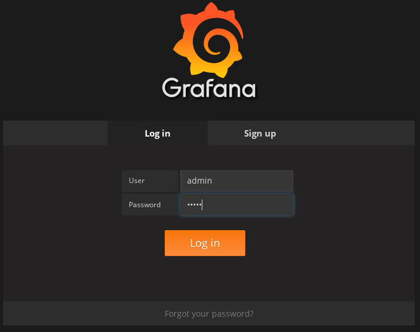

This section describes how it's possible to deploy a Prometheus server for scraping metrics from the Kafka cluster and showing them using a Grafana dashboard. The provided resources for deploying can't be considered production grade; they are used just as an example to show how it's possible to use the metrics feature provided in this project.

If you are going to use `minikube` or `minishift` for your Apache Kafka deployment adding Prometheus and Grafana servers, it would be better to increase the default amount of memory available to the virtual machine (i.e. not using the default 2 GB of RAM but 4 GB instead).
For doing that, you can start the OpenShift cluster by running

```
minishift start --memory 4GB
```

In case you want to use Kubernetes instead, you can run

```
minikube start --memory 4096
```

# Deploying on OpenShift

## Prometheus

The Prometheus server configuration uses a service discovery feature in order to discover the pods in the cluster from which it gets metrics.
In order to have this feature working, it's necessary to provide access to the API server to get the pod list to the service account used for running the Prometheus service pod (the service account `prometheus-server` is used).

```
export NAMESPACE=[namespace]
oc login -u system:admin
oc create sa prometheus-server
oc adm policy add-cluster-role-to-user cluster-reader system:serviceaccount:${NAMESPACE}:prometheus-server
oc login -u developer
```

where `[namespace]` is the namespace/project where the Apache Kafka cluster was deployed.

After that, it's possible to deploy the Prometheus server in the cluster :

1. Create the [provided "prometheus" template](prometheus/openshift-template.yaml) by running

        oc create -f metrics/prometheus/openshift-template.yaml

2. Create a new app using the "prometheus" template:

        oc new-app prometheus

## Grafana

A Grafana server is necessary only to get a UI for the Prometheus metrics. You can use the following [project](https://github.com/OpenShiftDemos/grafana-openshift) which you need to clone locally.

From the `grafana-openshift` directory, run

```
chmod +x root/usr/bin/fix-permissions 
chmod +x run.sh 
```

to set "execute" permissions on the above scripts and then run

```
oc new-build --binary --name=grafana
oc start-build grafana --from-dir=. --follow
```

to start the image building process inside the OpenShift cluster. 
After a while, the grafana image will be available in the internal Docker registry of the OpenShift cluster and the last step is just creating a new application with the provided image.

```
oc new-app grafana
```

# Deploying on Kubernetes

## Prometheus


The Prometheus server configuration uses a service discovery feature in order to discover the pods in the cluster from which it gets metrics.
In order to have this feature working, it's necessary to provide access to the API server to get the pod list to the service account used for running the Prometheus service pod (the service account `prometheus-server` is used) if the RBAC is enabled in your Kubernetes deployment.

```
export NAMESPACE=[namespace]
kubectl create sa prometheus-server
kubectl create -f metrics/prometheus/cluster-reader.yaml
kubectl create clusterrolebinding read-pods-binding --clusterrole=cluster-reader --serviceaccount=${NAMESPACE}:prometheus-server
```

where `[namespace]` is the namespace/project where the Apache Kafka cluster was deployed.

Finally, create the Prometheus service by running

        kubectl apply -f metrics/prometheus/kubernetes.yaml

## Grafana

A Grafana server is necessary only to get a UI for the Prometheus metrics. You can use the following [project](https://github.com/OpenShiftDemos/grafana-openshift) which you need to clone locally.

From the `grafana-openshift` directory, run

```
chmod +x root/usr/bin/fix-permissions 
chmod +x run.sh 
```

to set "execute" permissions on the above needed scripts.
If you are using `minikube` for running the Kubernetes cluster then you have to build the Grafana image inside the cluster itself in order to have it available in the internal Docker registry. To use the Docker environment in `minikube` run

```
eval $(minikube docker-env)
```

After that it's possible to build the image by running

```
docker build -t strimzi/grafana:latest .
```

Finally you can execute the actual deployment by running

```
kubectl apply -f metrics/grafana/kubernetes.yaml
```

# Grafana dashboard

As an example and in order to visualize the exported metrics in Grafana, the simple dashboard `kafka-dashboard.json` JSON file is provided.
Following these steps you'll be able to set up the Prometheus data source in Grafana and adding the above dashboard.

> If your cluster is running using `minikube` or `minishift`, you can use the `port-forward` command for forwarding traffic from the Grafana pod to the host. For example, running `oc port-forward grafana-1-fbl7s 3000:3000` (or using `kubectl` instead of `oc`) you can access the Grafana UI opening your browser and pointing to the `http://localhost:3000`.

1. Access to the Grafana UI using `admin/admin` credentials.



2. Click on the "Add data source" button from the Grafana home in order to add Prometheus as data source.


3. Fill in the information about the Prometheus data source, specifying a name and "Prometheus" as type. In the URL field you have to specify the connection string to the Prometheus server (i.e. `http://prometheus:9090`). Click on "Add" and after that, Grafana will test the connection with the data source.


4. From the top left menu, click on "Dashboards" and then "Import" for opening the "Import Dashboard" window where you can import the provided dashboard uploading the JSON file or copying/pastying its content.


5. After importing the dashboard you should see it in your Grafan home with first metrics about CPU and JVM memory usage. You can start to use the Kafka cluster, creating topics and exchanging messages in order to see the other metrics like messages in, bytes in/out per topic.


