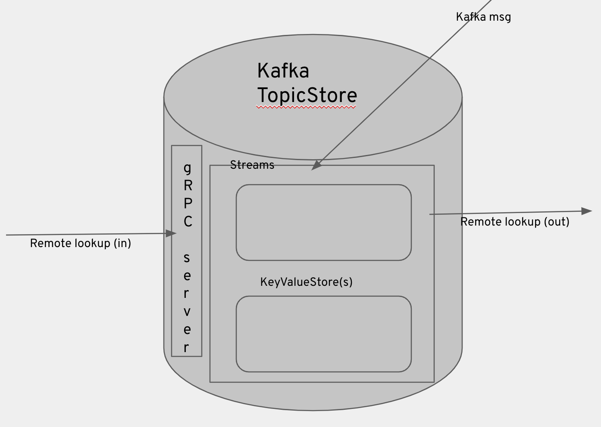

# Topic store (a new, Kafka Streams based, implementation) - design document

Topic store represents a persistent data store where the operator can store its copy of the 
topic state that won't be modified by either Kubernetes or Kafka.
Currently we have a working ZooKeeper based implementation, but with the ZooKeeper being removed 
as part of KIP-500, we have decided to implement the store directly in/on Kafka - its Streams
extension to be exact.

The TopicStore interface represents a simple async CRUD API.

```
interface TopicStore {

    /**
     * Asynchronously get the topic with the given name
     * completing the returned future when done.
     * If no topic with the given name exists, the future will complete with
     * a null result.
     * @param name The name of the topic.
     * @return A future which completes with the given topic.
     */
    Future<Topic> read(TopicName name);

    /**
     * Asynchronously persist the given topic in the store
     * completing the returned future when done.
     * If a topic with the given name already exists, the future will complete with an
     * {@link EntityExistsException}.
     * @param topic The topic.
     * @return A future which completes when the given topic has been created.
     */
    Future<Void> create(Topic topic);

    /**
     * Asynchronously update the given topic in the store
     * completing the returned future when done.
     * If no topic with the given name exists, the future will complete with a
     * {@link NoSuchEntityExistsException}.
     * @param topic The topic.
     * @return A future which completes when the given topic has been updated.
     */
    Future<Void> update(Topic topic);

    /**
     * Asynchronously delete the given topic from the store
     * completing the returned future when done.
     * If no topic with the given name exists, the future will complete with a
     * {@link NoSuchEntityExistsException}.
     * @param topic The topic.
     * @return A future which completes when the given topic has been deleted.
     */
    Future<Void> delete(TopicName topic);
}
```

The TopicStore is only used by the TopicOperator. 
The ZooKeeper watcher callbacks trigger TopicOperator reconciliations, 
and this notification mechanism will also need to be replaced before KIP-500 is fully implemented.

At the moment there seems to be a need for only a single instance of TopicStore, which
is an important detail with regard to the new Kafka Streams based implementation.

### Kafka Streams based implementation

In Kafka Streams you describe and configure your topics, processing, etc using the so called [Topology](https://kafka.apache.org/27/javadoc/org/apache/kafka/streams/Topology.html).
With it you describe the flow of your messages. As part of this processing you can make use
of the [Kafka Streams store](https://kafka.apache.org/20/documentation/streams/developer-guide/interactive-queries.html) 
. This is a local in-memory store, which is backed by the Kafka topic (created by the Kafka Streams)
so that the data is properly persisted and can be reloaded if there is a failure or a shutdown.

The "problem" with the store is that out-of-the-box we only get a local in-memory implementation
, where the data is distributed using the 'key hashing', which means that it is stored in exactly 
one of the running instances of this in-memory store - exactly which one it is depends on the Kafka Streams topology consumer instance that's consumimg the message.

What if we want an application, that uses the TopicStore, and runs in a clustered setup - distributed?
Then we need to provide our own distributed mechanism for the data lookup. Although the distributed implementation 
is not available, there is a [Kafka Streams API](https://kafka.apache.org/27/javadoc/org/apache/kafka/streams/KafkaStreams.html) that provides us with the needed information to (easily) implement
such a distributed mechanism - e.g. we can get the key owner's [HostInfo](https://kafka.apache.org/27/javadoc/org/apache/kafka/streams/state/HostInfo.html)
or HostInfos of all the available running stores.

We have built our distributed implementation on top of the [gRPC](https://grpc.io/). We needed to implement
both the client and the server side. gRPC has a [streaming API](https://docs.oracle.com/javase/8/docs/api/java/util/stream/Stream.html) implemented 
by its [StreamObserver](https://grpc.github.io/grpc-java/javadoc/io/grpc/stub/StreamObserver.html) mechanism - which is what we used
to implement the iterating methods of [ReadOnlyKeyValueStore API](https://kafka.apache.org/27/javadoc/org/apache/kafka/streams/state/ReadOnlyKeyValueStore.html)
. The data exchanged between the gRPC client and the server is based on [Protobuf](https://developers.google.com/protocol-buffers).  

The next problem we had to tackle was the async nature of Kafka and the lack of a callback API.
In order to provide the proper result (success or failure) for those TopicStore async CRUD methods,
we implemented the gRPC based async functions. Prior to pushing the data into the store
(via producing a Kafka message), we issue a distributed function call, which registers a CompletableFuture
on the right node (using the same key hashing as the next store update call) which is returned when the data is actually updated in the store.
The data lookup is done directly on the distributed store implementation - no distributed function call is needed.

If we don't need distribution / cluster, things get simplifed a lot - no gRPC needed, plain local in-memory store and async function.
By default this simple single instance is expected. In order to use the distributed implementation,
you need to set STRIMZI_DISTRIBUTED_STORE env variable to "true".

Other configuration options are listed here:
```
    /**
     * The store topic for the Kafka Streams based TopicStore
     */
    public static final Value<String> STORE_TOPIC = new Value<>(TC_STORE_TOPIC, STRING, "__strimzi_store_topic");
    /** The store name for the Kafka Streams based TopicStore */
    public static final Value<String> STORE_NAME = new Value<>(TC_STORE_NAME, STRING, "topic-store");
    /** The application id for the Kafka Streams based TopicStore */
    public static final Value<String> APPLICATION_ID = new Value<>(TC_APPLICATION_ID, STRING, "__strimzi-topic-operator-kstreams");
    /** The (gRPC) application server for the Kafka Streams based TopicStore */
    public static final Value<String> APPLICATION_SERVER = new Value<>(TC_APPLICATION_SERVER, STRING, "localhost:9000");
    /** The stale timeout for the Kafka Streams based TopicStore */
    public static final Value<Long> STALE_RESULT_TIMEOUT_MS = new Value<>(TC_STALE_RESULT_TIMEOUT_MS, DURATION, "5000");
    /** Is distributed KeyValue store used for the Kafka Streams based TopicStore */
    public static final Value<Boolean> DISTRIBUTED_STORE = new Value<>(TC_DISTRIBUTED_STORE, BOOLEAN, "false");

    /** Do we use old ZooKeeper based TopicStore */
    public static final Value<Boolean> USE_ZOOKEEPER_TOPIC_STORE = new Value<>(TC_USE_ZOOKEEPER_TOPIC_STORE, BOOLEAN, "false");
```

A cluster of TopicStore (Storage) would look like this:


And a simple lookup:


